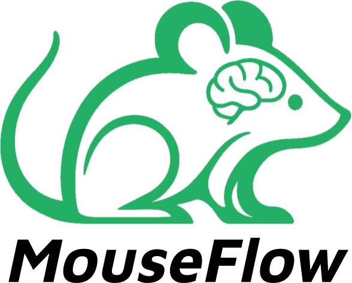

nf-mouse pipeline is developed by the Sherbrooke Connectivity Imaging Lab (SCIL) and Neurofunctional Imaging Group (GIN-IMN) in order to process diffusion MRI dataset from the raw data to the tractography.

Using on diffusion data nf-mouse is a nextflow pipeline based on [nf-neuro](https://github.com/scilus/nf-neuro).

It incorporates essential steps: denoising, corrections of some artefacts, registration to a template (Allen Mouse Brain Atlas), the DTI and QBall reconstructions, extraction of some metrics, until constructing a whole brain tractogram of the mouse brain and extracting some bundles. It is capable of adapting the resolution of the atlas according to the native data, for better anatomical alignment.

### :warning: WARNING :warning:

This pipeline is currently in development. We highly encourage everyone to give it a try and give us feedback and raise issues if any.

### In development features (non exhaustive list)

- BIDS compliant
- Meta metric QC across mouses
